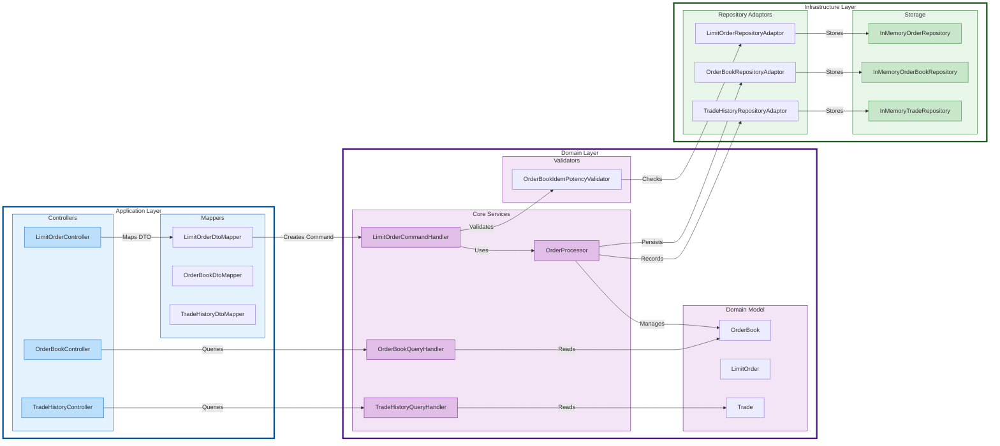
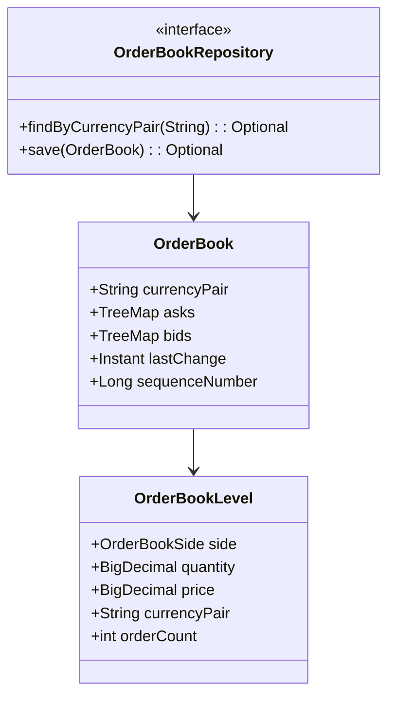
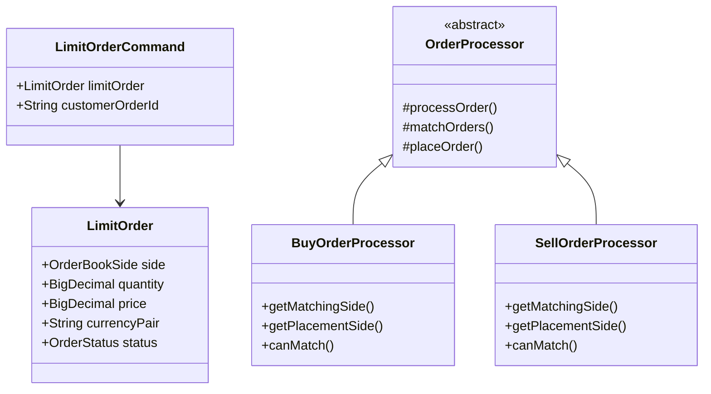
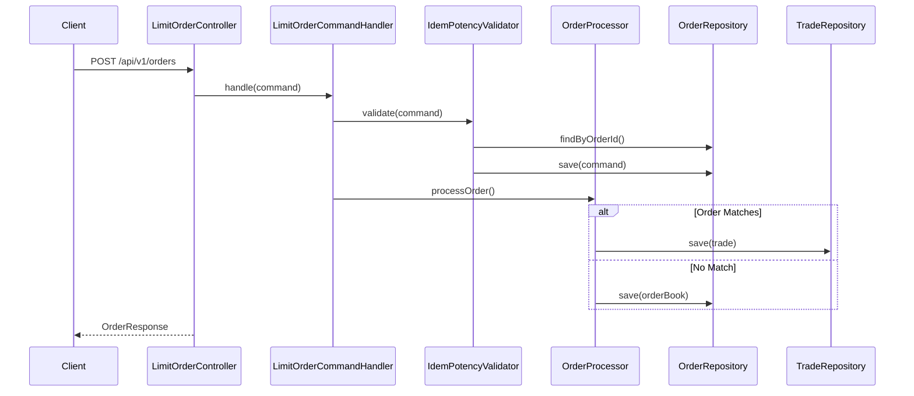
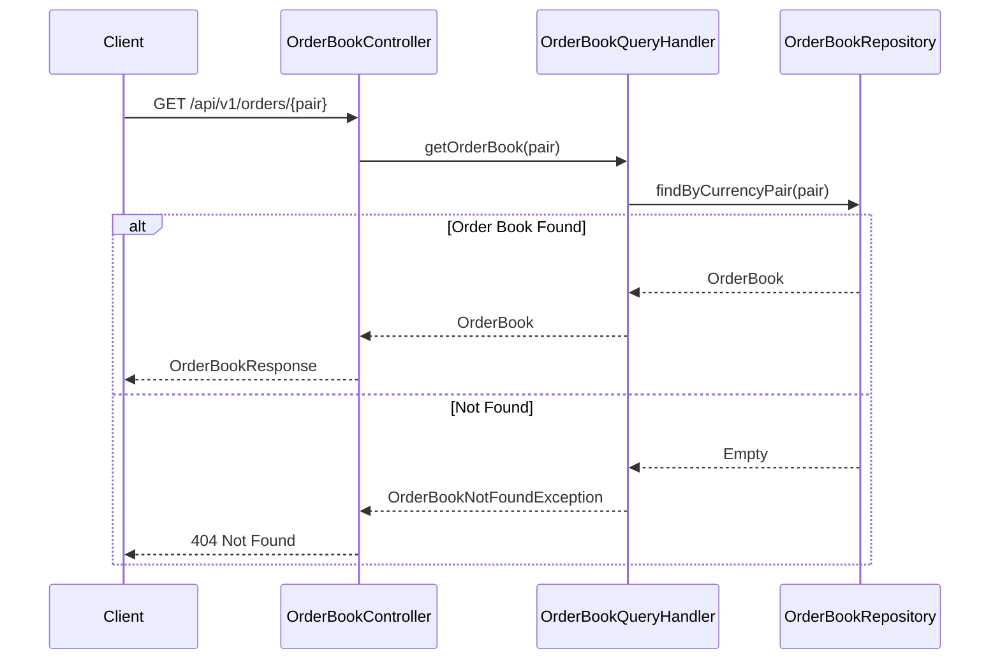
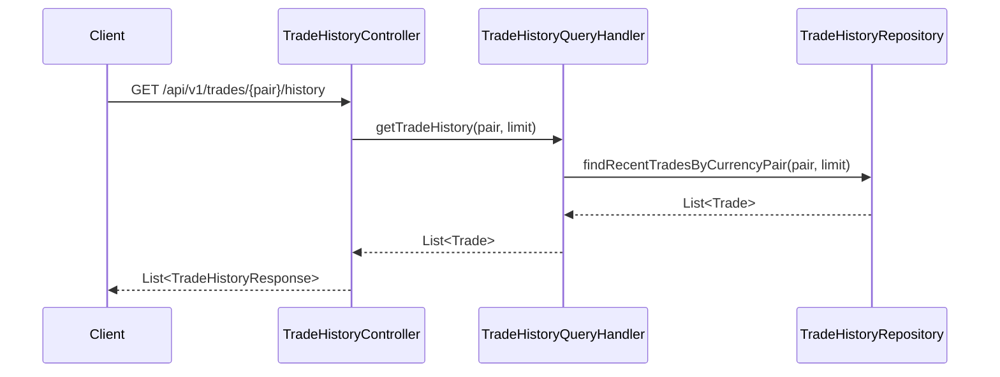

[](https://sonarcloud.io/summary/new_code?id=Puneethkumarck_trading-api)
[](https://sonarcloud.io/summary/new_code?id=Puneethkumarck_trading-api)

[](https://sonarcloud.io/summary/new_code?id=Puneethkumarck_trading-api)
[](https://sonarcloud.io/summary/new_code?id=Puneethkumarck_trading-api)
[](https://sonarcloud.io/summary/new_code?id=Puneethkumarck_trading-api)
[](https://railway.app/template/aYpw1-?referralCode=F4Yi_e)
[](https://god.gw.postman.com/run-collection/685178-34771dde-0c1a-4fa2-8613-14a572120e88?action=collection%2Ffork&source=rip_markdown&collection-url=entityId%3D685178-34771dde-0c1a-4fa2-8613-14a572120e88%26entityType%3Dcollection%26workspaceId%3De03b2ab3-447a-4a5f-8818-be163b36a6e7#?env%5Brailway%5D=W3sia2V5IjoidXJsIiwidmFsdWUiOiJodHRwczovL2NyeXB0by1hcGktcHJvZHVjdGlvbi00NzNhLnVwLnJhaWx3YXkuYXBwIiwiZW5hYmxlZCI6dHJ1ZSwidHlwZSI6ImRlZmF1bHQifV0=)

# Trading API

A Kotlin-based cryptocurrency trading API that provides order book management, limit order processing, and trade history tracking capabilities.

## Table of Contents
- [Overview](#overview)
- [Features](#features)
- [Technology Stack](#technology-stack)
- [Architecture](#architecture)
- [API Documentation](#api-documentation)
- [Component Diagrams](#component-diagrams)
- [Sequence Diagrams](#sequence-diagrams)
- [Class Diagrams](#class-diagrams)
- [Setup and Configuration](#setup-and-configuration)
- [Code Quality](#code-quality)

## Overview

The Trading API is a Spring Boot application that implements a cryptocurrency trading platform with support for:
- Order book management
- Limit order processing
- Trade history tracking

## Features

### 1. Order Book Management
- Maintains buy (bid) and sell (ask) orders
- Aggregated view of orders at each price level

### 2. Limit Order Processing
- Support for BUY and SELL orders
- Partial and full order fills

### 3. Trade History
- Real-time trade execution recording
- Historical trade lookup
- Trade aggregation by currency pair
- Pagination support

### 4. Additional Features
- Idempotent order submission
- Concurrency handling
- Input validation
- Error handling with appropriate HTTP status codes
- API documentation with OpenAPI/Swagger
- Spring Security basic authentication

## Technology Stack

- **Framework**: Spring Boot 3.3.4
- **Language**: Java 21, Kotlin
- **Build Tool**: Gradle
- **Testing**: JUnit 5, Kotlin mock
- **Documentation**: OpenAPI/Swagger
- **Code Quality**:
    - SonarCloud
    - JaCoCo for code coverage
    - Spotless for code formatting
- **Libraries**:
    - MapStruct for object mapping
    - Jackson for JSON processing
    - Lombok for boilerplate reduction
    - Spring Validation

## Architecture

The application follows a hexagonal (ports and adapters) architecture pattern with the following layers:

1. **API Layer** (Application)
    - Controllers
    - DTOs
    - Mappers
    - Exception Handlers

2. **Domain Layer**
    - Order Book Logic
    - Limit Order Processing
    - Trade Management
    - Domain Models

3. **Infrastructure Layer**
    - Repositories
    - Service Adapters
    - Entity Classes

### Component Diagram




### Class Diagrams

#### Order Book Classes



#### Limit Order Classes



### Sequence Diagrams

#### Place Limit Order



#### Get Order Book



#### Get Trade History



## Setup and Configuration

### Prerequisites
- Java 21
- Gradle 8.x

### Build and Run
```bash
# Build the project
./gradlew clean build
```

```bash
# Run tests
./gradlew test
```

```bash
# Run the application
./gradlew bootRun
```

### API Documentation
The API documentation is available at : [swagger](https://trading-api-production-057a.up.railway.app/swagger-ui/index.html)

### Code Style
The project uses Spotless with Eclipse formatter for consistent code style. Format the code using:
```bash
./gradlew spotlessApply
```